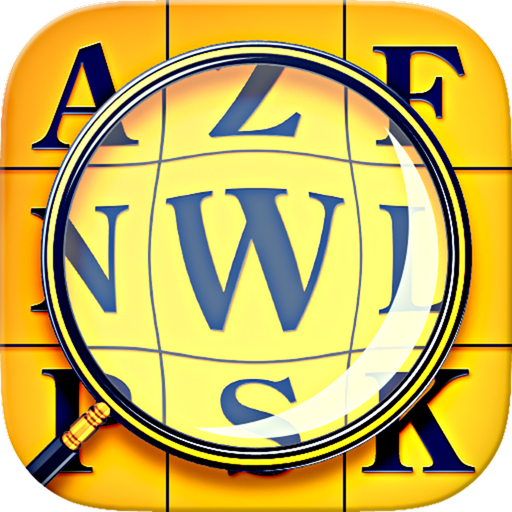
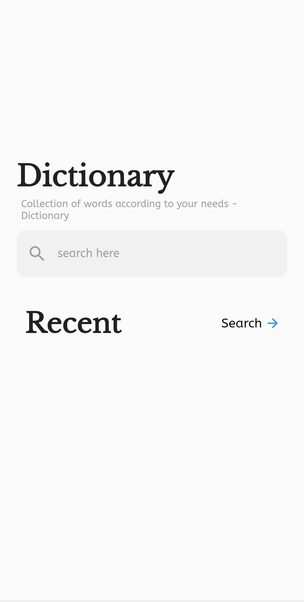
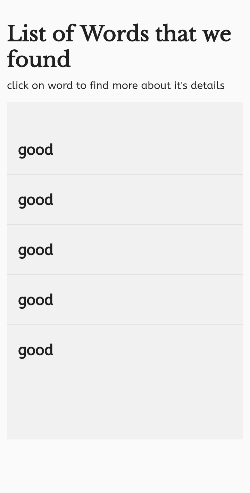
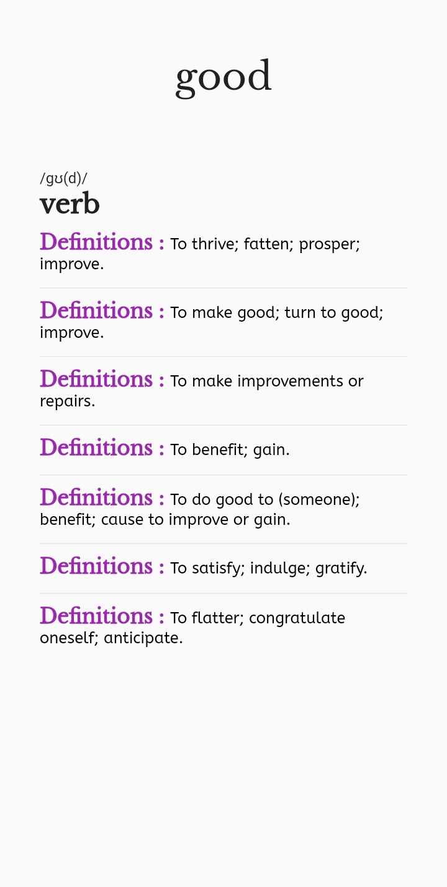
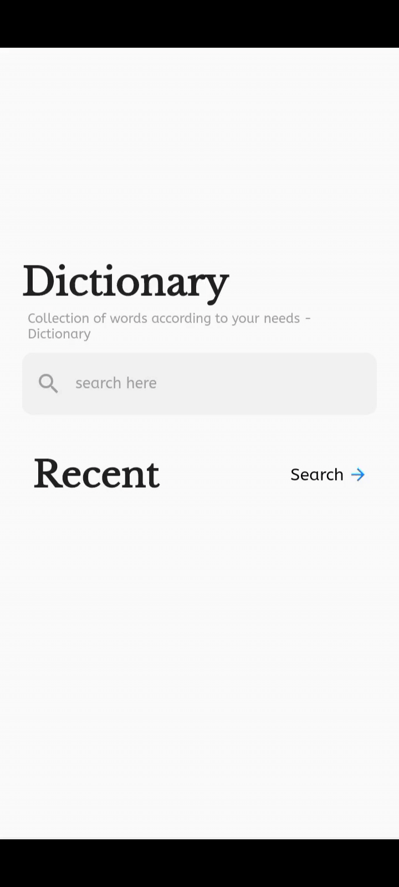

# Dictionary App

A new Flutter Dictionary project.

## Getting Started

This is dictionary app made with flutter using Bloc state management.

### Packages used

1. http
2. flutter_bloc

## API Website

[Dictionary API](https://dictionaryapi.dev)

### Demo Images

### Live Demo

